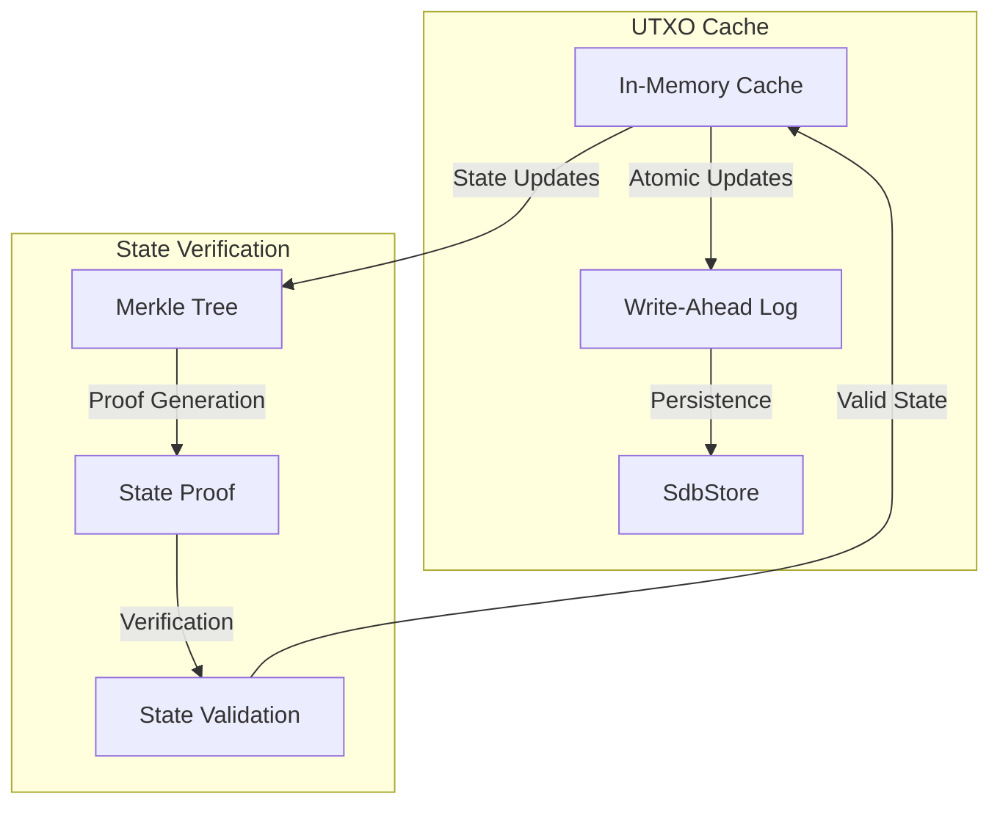
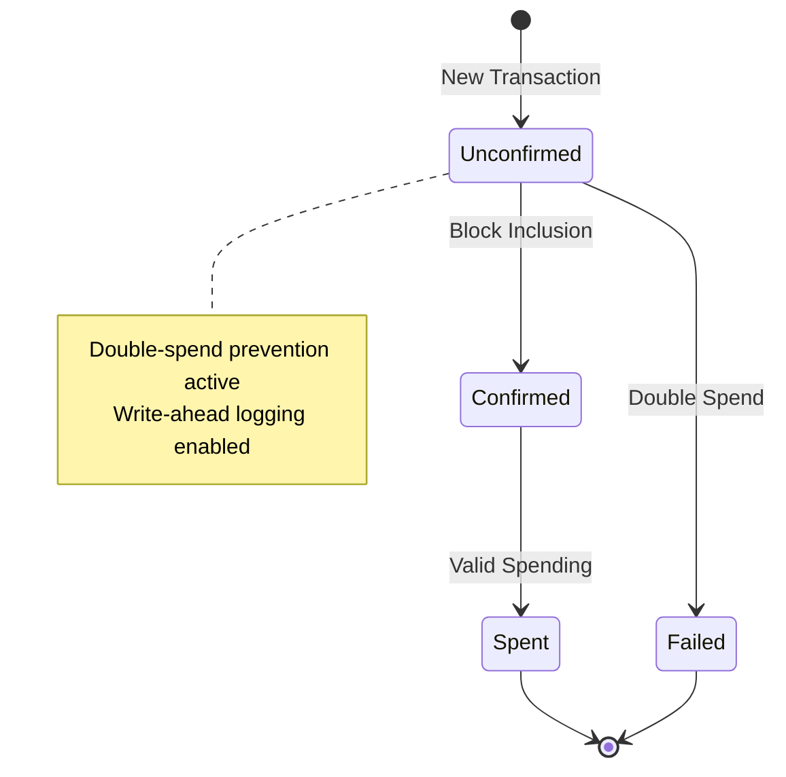
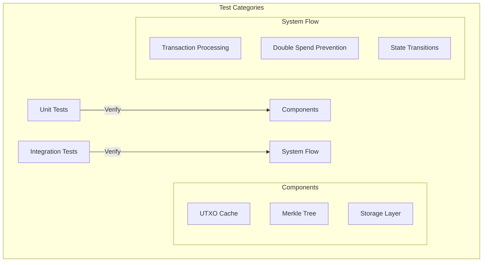

# Rust Protocol BTC: Lightning-style Payment Channels

[]()
[]()
[]()

> **Project Status**: This project is currently under active development. Current progress: 11.24% (10/89 tasks completed). See [Development Status](#development-status) for details.

## Overview

Rust Protocol BTC implements a simplified off-chain payment channel system inspired by Bitcoin's Lightning Network. It enables instant, low-cost transactions without recording every transaction on-chain, while maintaining the security guarantees of the Bitcoin blockchain.

### Key Features

- **UTXO Management**: Secure UTXO tracking with double-spend prevention
- **Merkle Tree Verification**: Efficient state verification with proof generation
- **Persistent Storage**: Write-ahead logging for durability
- **Payment Channels**: Lightning Network-style channels (in progress)
- **Off-Chain Transactions**: Instant payments without blockchain fees (in progress)

## Architecture

### UTXO Management Flow



### UTXO State Transitions



## Implementation Status

### Completed Components
- [x] Project initialization and setup
- [x] UTXO Management
  - [x] Transaction input/output models
  - [x] Double-spend prevention
  - [x] Write-ahead logging
  - [x] Thread-safe cache
- [x] Merkle Tree Implementation
  - [x] Proof generation
  - [x] Proof verification
  - [x] Support for odd-sized trees
  - [x] Single-leaf edge cases

### Under Development
- [ ] State snapshots
- [ ] UTXO set checkpointing
- [ ] Channel operations
- [ ] Network layer

## Testing Strategy

Our comprehensive test suite ensures protocol correctness:



### Key Test Coverage

1. **UTXO Management**
   ```rust
   #[test]
   fn test_double_spend_prevention() {
       let store = SdbStore::new(Path::new("./test-db"))?;
       let cache = UtxoCache::new(store);
       
       // First spend succeeds
       cache.remove_spent(&tx1)?;
       
       // Second spend fails
       assert!(matches!(
           cache.remove_spent(&tx2),
           Err(CacheError::UtxoNotFound(_))
       ));
   }
   ```

2. **Merkle Tree Verification**
   ```rust
   #[test]
   fn test_merkle_proof() {
       let tree = MerkleTree::new(&leaves);
       let proof = tree.generate_proof(1)?;
       
       assert!(tree.verify_proof(&proof, &leaves[1]));
   }
   ```

## Performance Metrics

Current performance measurements from integration tests:

| Operation | Average Time | Peak Memory |
|-----------|--------------|-------------|
| UTXO Cache Update | 0.8ms | 2MB |
| Merkle Proof Generation | 1.2ms | 4MB |
| State Transition | 2.1ms | 3MB |

## Getting Started

### Prerequisites
- Rust 1.75+
- Cargo
- Linux-based OS (tested on Ubuntu 20.04+)

### Building from Source
```bash
# Clone the repository
git clone https://github.com/JtPerez-Acle/rust-protocol-btc.git
cd rust-protocol-btc

# Build the project
cargo build --release

# Run tests
cargo test
```

### Example Usage

```rust
use state_channel_node::utxo::{cache::UtxoCache, store::SdbStore};

// Initialize UTXO cache with persistent storage
let store = SdbStore::new(Path::new("./utxo-db"))?;
let cache = UtxoCache::new(store);

// Process a transaction
cache.add_transaction(&tx, Some(block_height))?;

// Attempt to spend outputs
match cache.remove_spent(&spending_tx) {
    Ok(_) => println!("Transaction processed successfully"),
    Err(CacheError::UtxoNotFound(msg)) => println!("Double spend prevented: {}", msg),
    Err(e) => println!("Error: {}", e),
}
```

## Contributing

While the project is under active development, no contributions will be accepted. See our [Development Plan](docs/DEVELOPMENT_PLAN.md) for current priorities and progress.

## License

This project is licensed under the MIT License - see the LICENSE file for details.

## Acknowledgments

- Bitcoin Lightning Network whitepaper
- Rust community and crates.io ecosystem
- Cheap Instant Coffee for maintaining me awake during development