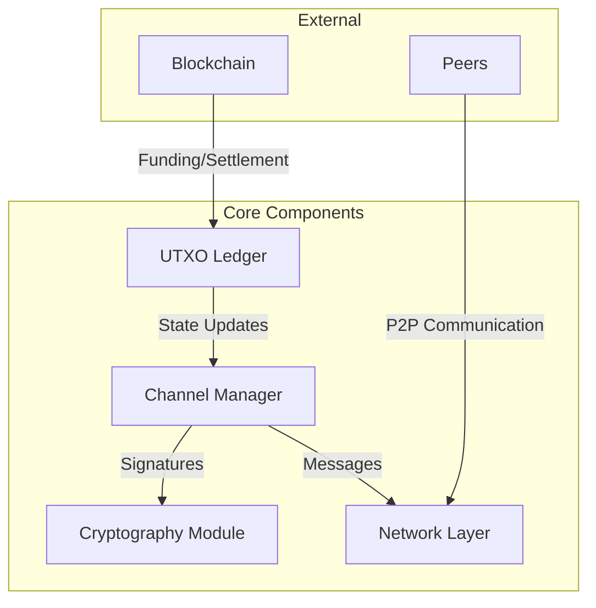
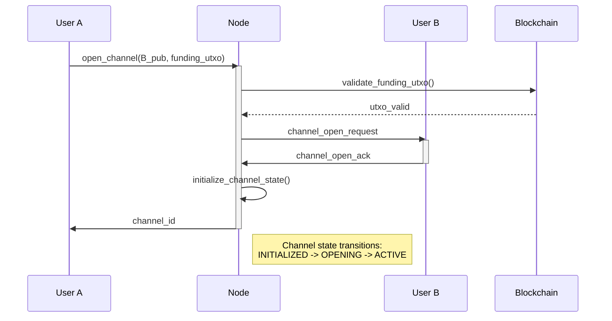
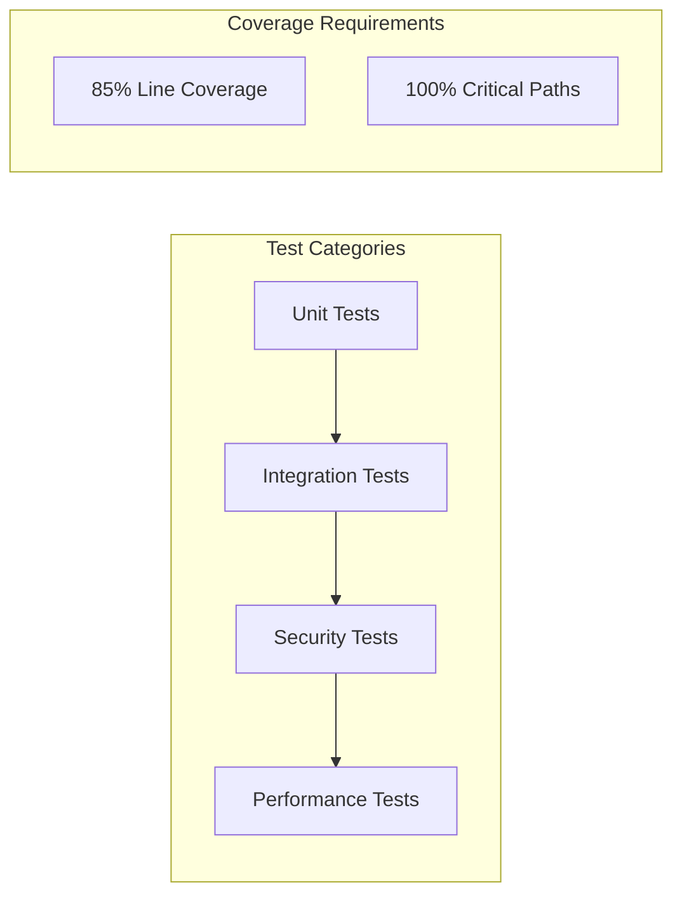

# Rust Protocol BTC: Lightning-style Payment Channels

[]()
[]()
[]()

> ⚠️ **Project Status**: This project is currently under active development. Current progress: 6.74% (6/89 tasks completed). See [Development Status](#development-status) for details.

## Overview

Rust Protocol BTC implements a simplified off-chain payment channel system inspired by Bitcoin's Lightning Network. It enables instant, low-cost transactions without recording every transaction on-chain, while maintaining the security guarantees of the Bitcoin blockchain.

### Key Features

- ✅ **UTXO-Based Payment Channels**: Lightning Network-style channels
- ✅ **Off-Chain Transactions**: Instant payments without blockchain fees
- ✅ **Secure State Management**: Cryptographically secure state transitions
- ✅ **Byzantine Fault Tolerance**: Robust against malicious participants
- ✅ **Rust Implementation**: Memory safety and high performance

## Architecture

### System Components



### Channel Lifecycle



## Implementation Status

### Completed Components
- [x] Project initialization and setup
- [x] Basic UTXO structure
- [x] Transaction input/output models
- [x] Serialization/deserialization
- [x] UTXO set management
- [x] CI/CD pipeline configuration

### Under Development
- [ ] State management system
- [ ] Channel operations
- [ ] Cryptography module
- [ ] Network layer
- [ ] Dispute resolution
- [ ] Batch processing

## Testing Strategy

Our testing approach ensures protocol correctness and security through multiple layers:



### Key Test Areas

1. **Unit Tests**
   ```rust
   #[test]
   fn test_utxo_state_transitions() {
       // Test UTXO creation, spending, and validation
   }
   ```

2. **Integration Tests**
   ```rust
   #[test]
   fn test_complete_channel_flow() {
       // 1. Open channel
       // 2. Multiple state updates
       // 3. Graceful closure
   }
   ```

3. **Security Tests**
   ```rust
   #[test]
   fn test_byzantine_behavior() {
       // Test system response to malicious participants
   }
   ```

## Performance Targets

| Metric | Target |
|--------|--------|
| Transaction Processing | < 100ms |
| State Updates | < 50ms |
| Memory Usage | < 4GB |

## Getting Started

### Prerequisites
- Rust 1.75+
- Cargo
- Linux-based OS (tested on Ubuntu 20.04+)

### Building from Source
```bash
# Clone the repository
git clone https://github.com/JtPerez-Acle/rust-protocol-btc.git
cd rust-protocol-btc

# Build the project
cargo build --release

# Run tests
cargo test
```

## API Example

```rust
// Create a new payment channel
async fn example_usage() -> Result<(), ChannelError> {
    let channel_id = open_channel(
        initiator_pub,
        participant_pub,
        funding_utxo
    ).await?;

    // Update channel state
    update_channel(
        &channel_id,
        signed_transaction
    ).await?;

    // Close channel
    close_channel(&channel_id).await?;
    
    Ok(())
}
```

## Contributing

While the project is under active development, no contributions are accepted. Please see our [Development Plan](docs/DEVELOPMENT_PLAN.md) for current priorities and progress.

## License

This project is licensed under the MIT License - see the LICENSE file for details.

## Acknowledgments

- Bitcoin Lightning Network whitepaper
- Rust community and crates.io ecosystem
- Cheap Instant Coffee for maintaining me awake during development 