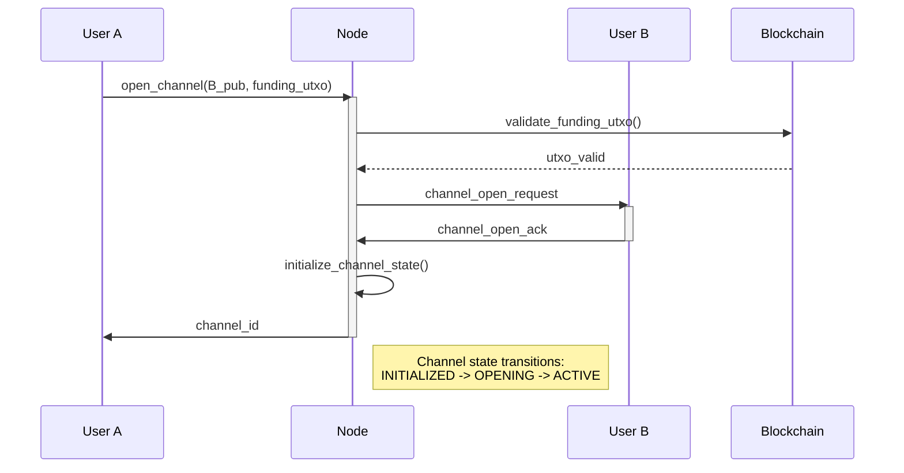
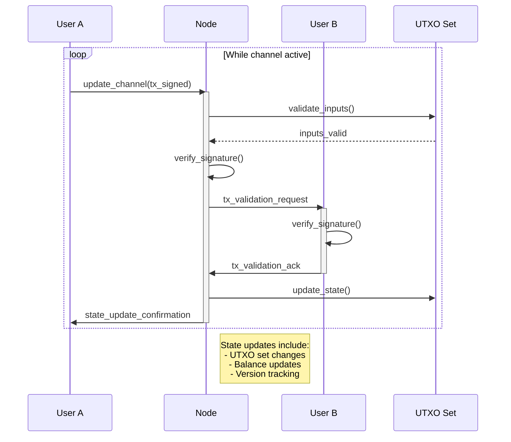
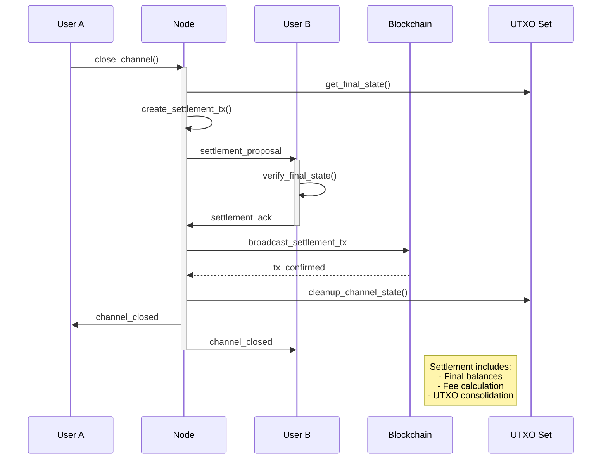
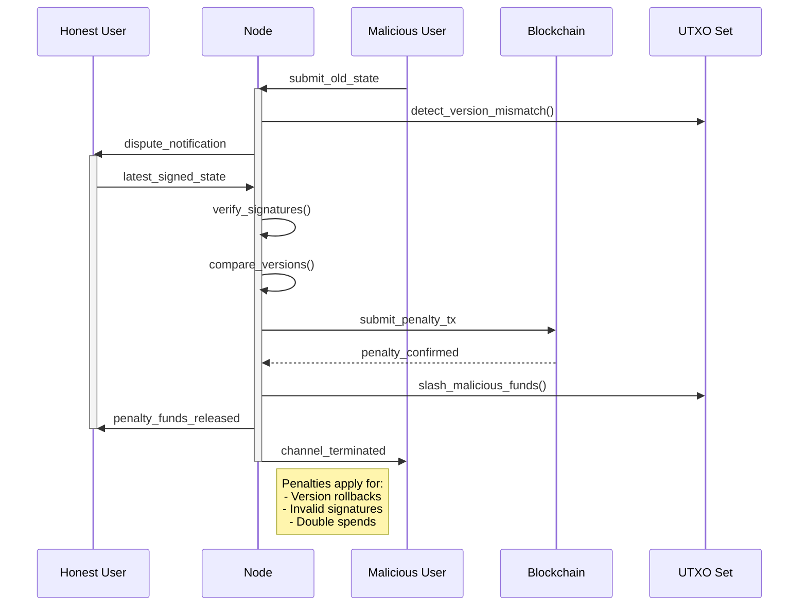
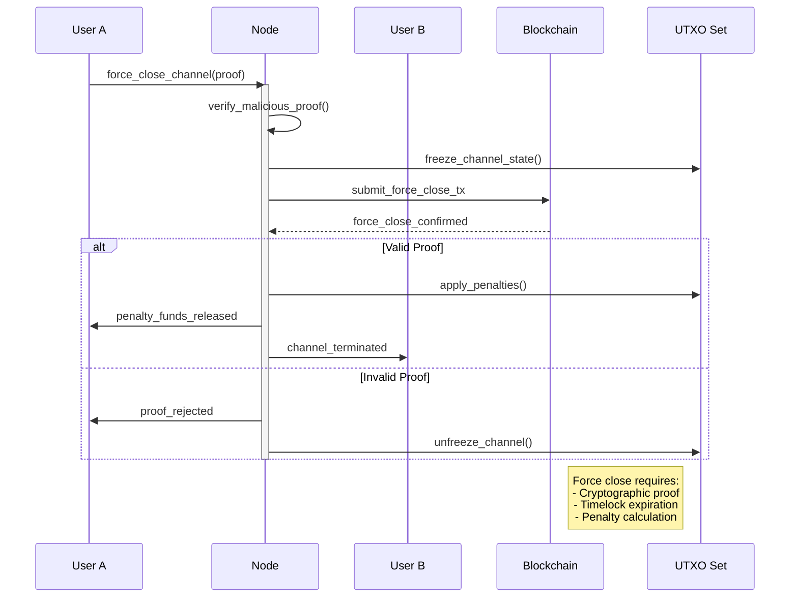
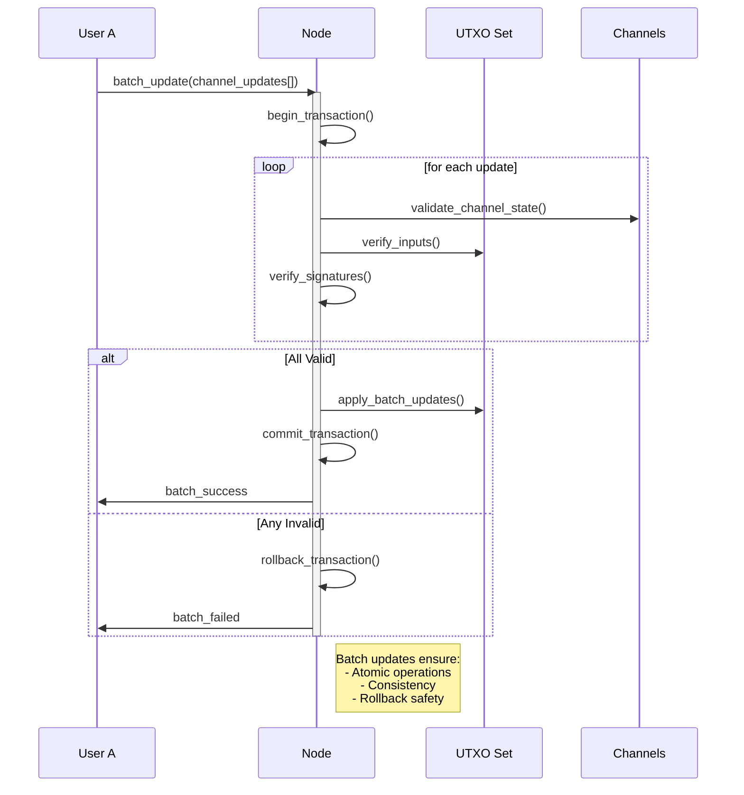

# Payment Channel Sequence Diagrams

## 1. Channel Lifecycle

### 1.1 Channel Opening
This diagram illustrates the process of opening a new payment channel between two users. The sequence shows:
- Initial funding transaction validation
- Channel request and acknowledgment between parties
- State initialization and channel ID assignment
- Safety checks to ensure proper channel establishment



### 1.2 Channel Operation
This diagram shows the core operation of an active payment channel, demonstrating:
- How state updates are processed and validated
- The signature verification flow between parties
- UTXO set management for each transaction
- Concurrent operation handling with proper activation/deactivation



### 1.3 Channel Settlement
This diagram details the channel closure process, showing:
- How final states are computed and verified
- The settlement transaction creation and broadcast
- Cleanup procedures for channel resources
- Confirmation flow between all parties



## 2. Dispute Resolution

### 2.1 Malicious State Update
This diagram demonstrates the protocol's handling of malicious behavior, specifically:
- Detection of outdated state submissions
- The dispute resolution process
- Penalty enforcement mechanisms
- Fund protection for honest participants



### 2.2 Forced Channel Closure
This diagram illustrates the emergency closure mechanism, showing:
- Proof verification for forced closure
- Channel state freezing process
- Penalty application logic
- Different outcomes based on proof validity



## 3. Batch Operations

### 3.1 Multi-Channel Update
This diagram shows how multiple channel updates are processed atomically:
- Transaction batching mechanism
- Validation steps for each update
- Atomic commit/rollback process
- Error handling for partial failures



### 3.2 Network Synchronization
This diagram demonstrates how nodes maintain consistent state across the network:
- Multi-node synchronization process
- Parallel state retrieval
- Conflict detection and resolution
- Network-wide consistency maintenance

```mermaid
sequenceDiagram
    participant NA as Node A
    participant NB as Node B
    participant NC as Node C
    participant UTXOA as UTXO Set A

    NA->>NB: sync_request()
    NA->>NC: sync_request()
    activate NA

    par
        NB->>NA: channel_states_b
    and
        NC->>NA: channel_states_c
    end

    NA->>NA: verify_states()
    NA->>UTXOA: merge_states()

    alt Conflict Detected
        NA->>NB: resolve_conflict()
        NA->>NC: resolve_conflict()
        NA->>UTXOA: apply_resolution()
    end

    NA->>NB: sync_complete
    NA->>NC: sync_complete
    deactivate NA

    Note right of NA: Sync ensures:<br/>- State consistency<br/>- Conflict resolution<br/>- Network consensus
