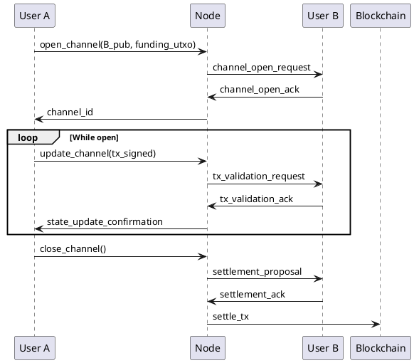
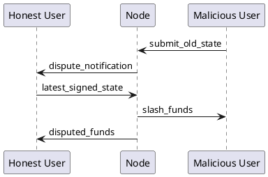

# Payment Channel Sequence Diagrams

## Channel Lifecycle

```plantuml
@startuml Channel Lifecycle
participant "User A" as A
participant "Node" as N
participant "User B" as B

A -> N: open_channel(B_pub, funding_utxo)
N -> B: channel_open_request
B -> N: channel_open_ack
N -> A: channel_id

loop While open
A -> N: update_channel(tx_signed)
N -> B: tx_validation_request
B -> N: tx_validation_ack
N -> A: state_update_confirmation
end

A -> N: close_channel()
N -> B: settlement_proposal
B -> N: settlement_ack
N -> Blockchain: settle_tx
@enduml
```

## Dispute Resolution

```plantuml
@startuml Dispute Flow
participant "Honest User" as H
participant "Node" as N
participant "Malicious User" as M

M -> N: submit_old_state
N -> H: dispute_notification
H -> N: latest_signed_state
N -> M: slash_funds
N -> H: disputed_funds
@enduml
```
